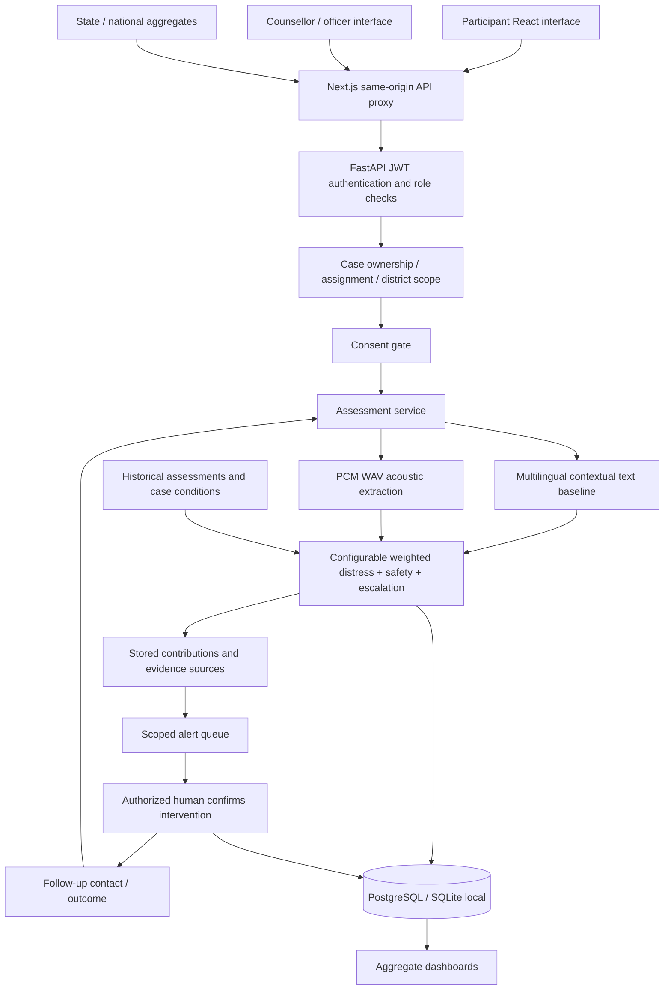

# Architecture

`backend/app/database.py` owns relational entities and foreign keys. Identity (`users`, `victims`) is separate from cases and assessment detail. JSON columns store versionable feature contracts rather than arbitrary executable content. Every table has an ID and creation timestamp. `migrate.py` records schema version 0001; add forward-only migrations for later schema changes.

`auth.py` implements scrypt password hashing and JWT validation. `services.py` contains shared case scoping, consent checks, assessment persistence, notifications, and outcome aggregation. `main.py` provides validated API routes. `analytics.py` exposes role-scoped aggregates and model monitoring. `ai.py` contains CPU NLP, audio, feature, trend, score and inference functions. `ai/train.py` is an independent reproducible training entry point.

Transactions save assessment, responses, computed features, explanations and alert together. No frontend risk scoring or authentication bypass exists. Explicit victim response projections omit internal staff notes and risk analytics. Aggregate-only roles cannot call case APIs. Audits record access and changes without copying sensitive text.

Frontend feature components separate participant workflow, authority dashboards, case review, voice capture, maps and charts. English/Hindi/Hinglish participant strings are in `frontend/i18n/`. Additional languages can reuse the response schema and add dictionaries and signal resources. Staff analytical terminology currently uses English.

AI recommendations do not create an intervention. A counsellor/officer/system administrator must explicitly call the authorized intervention endpoint. Safety support requests create alerts, not police or protection action. Mock adapters return `external_delivery: false`.
